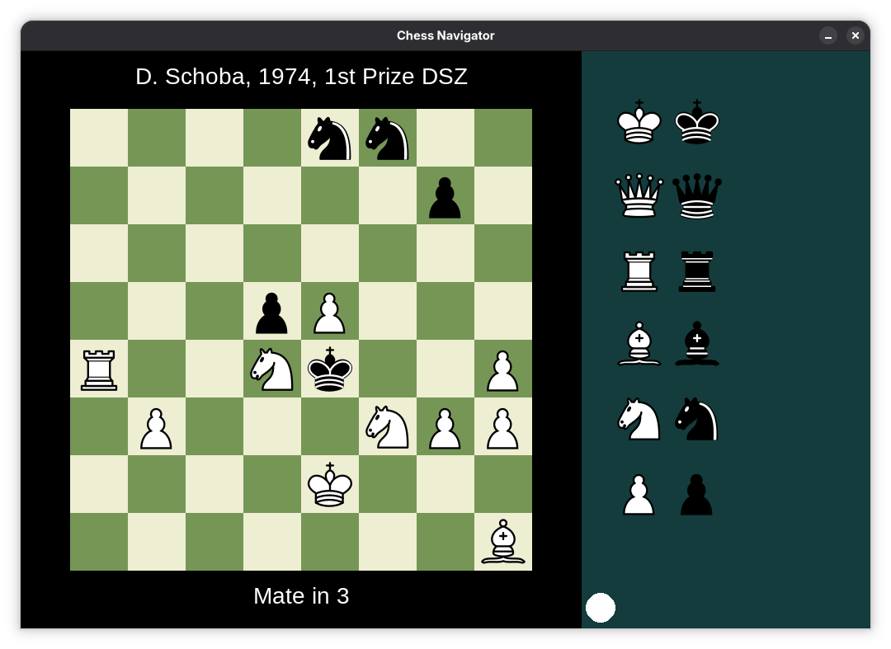
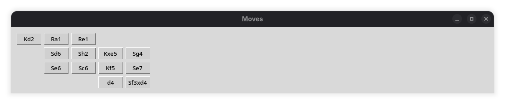
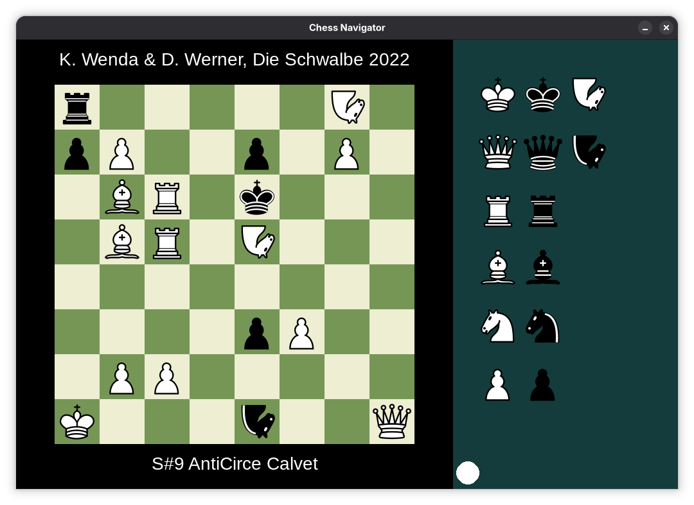
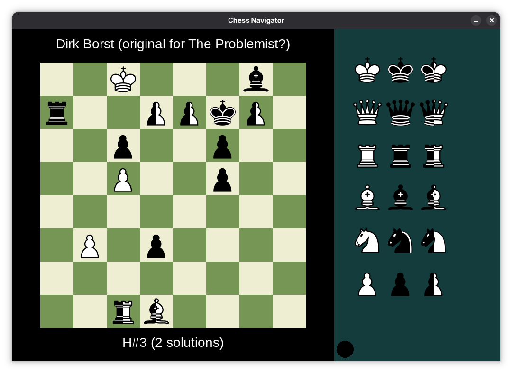
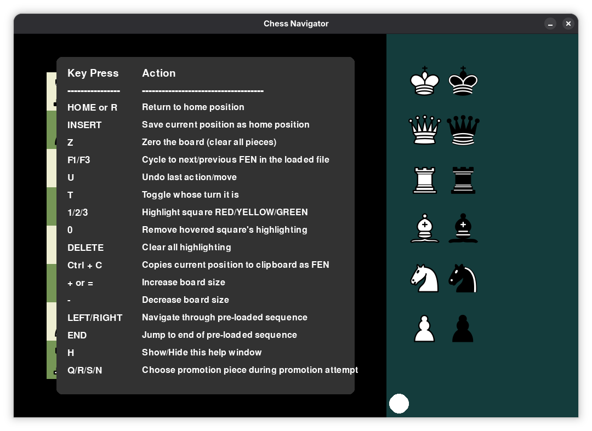

My Chess Navigator program for showing chess problems. It's a chess board only (no engine and not even move logic).

It allows very quick position setup, and can navigate a complex defined move tree, saved in a text file.

The PROBLEM_LIST.txt file shows the template for autoloading lots of FENs (with optional title and subtext/stipulation), and possible move trees.

I am not a software developer so apologies in advance for any bugs or bad implementation. Please do let me know, however, as I will happily fix things if I can.

## Screenshots






*See bottom of page for additional screenshots.*

## Getting started

+ The releases section has a Windows Installer.
+ It works in Linux and Windows, I've not tested on MacOSX.
+ It works in Python 3.13 (and 3.12)

This is a python project, with `uv` support included. So you can just use uv for easy running from source.

### With `uv` installed (from source)

Requires Python 3.12 or 3.13 (recommended) NOT 3.14

Just run

```
uv sync
uv run python ChessNavigator.py
```

### With your own virtual environment (from source)

Create the virtual environment (see pyproject.toml file for required packages).

```
python3.13 ChessNavigator.py
```

## Method of move entry

New move entry is by dragging the mouse.

If you desire to use separate clicks to move pieces then press CAPS LOCK. 
Trying to drag pieces while caps lock is on won't behave as usual. As clicks are processed first.

Various shortcuts are currently implemented but not always fully documented.

**Press H inside the program to bring up the help menu.**

| Key       | Action                                                     |
|-----------|------------------------------------------------------------|
| HOME or R | Return to home position                                    |
| INSERT    | Save current position as home position                     |
| Z         | Zero the board                                             |
| F1/F3     | Cycle to next/previous FEN in the loaded file              |
| U         | Undo last move (cannot currently undo after add/remove)    |
| T         | Toggle whose turn it is (also clickable)                   |
| (1,2,3,0) | Highlight hovered square: RED, YELLOW, GREEN, NO-HIGHLIGHT |
| Ctrl + C  | Copy current position to clipboard as FEN                  |
| +/-       | Decrease/Increase window size                              |
| DELETE    | Clear all highlighting                                     |
| ➡         | Step into predefined move tree                             |
| ⬅         | Step back along predefined move tree                       |
| END       | Jump to end of predefined move tree                        |
| rsbq      | Select promotion piece  (during promotion attempt)         |

### Adding and removing pieces

Add new pieces by dragging them from the extra pieces panel.

Removing pieces by dragging them from the board and dropping them off the board.

If you add pieces from the panel using the right-mouse-button you can keep adding more pieces of the same type without returning to the panel.

## For pre-stored analysis

### Predefined tree file

Default file is PROBLEM_LIST.txt, can be overridden with `--fenlist` command-line argument.

### Syntax of tree file

Blank lines and lines not beginning "Title:", "FEN:", "Subtext:" or "Moves:" are ignored.
Sensible to separate problems with blank lines.

Title: Text above the diagram  
FEN: FEN of the diagram  
Subtext: Text to appear below the diagram  
Moves: e2e4 g8f6 e4e5 f6e5 etc.. (see below)  

Sample move syntax is as follows:

e2e4 e7e5 g1f3 b8c6 * f1b5 a7a6 < f1c4 f8c5 * b2b4 c5b4 < c2c3 d7d5 << d2d4 e5d4 H g1f3 g7g5 f3g5

| Format | Result                                      |
|--------|---------------------------------------------|
| a1b3   | Move piece from a1 to b3                    |
| a7b8s  | Promote a7b8 to a knight                    |
| *      | Save the current position for future return |
| <      | Go back to last saved position              |
| <<     | Go back to second last saved position       |
| <<<    | Go back to third last saved position        |
| etc..  |                                             |
| H      | Go back to Home position for this problem   |
| +Ra7   | Add a white rook to a7 (capital = white)    |
| -e4    | Remove whatever piece is on e4              |
| &      | Separator for multiple simultaneous moves   |

When using the moves window additional moves window, you can also navigate the position tree by clicking the moves in that window. (By default the moves window opens, it can be disabled below)

## For customized board colours, start-up window size and piece animations

### config.json file format - default values

Edit a file with this name in the executable's folder and it will be used instead.

{  
    "white_squares": [238, 238, 210],  
    "black_squares": [118, 150, 86],  
    "panel_colour": [20, 60, 60],  
    "square_size": 70,  
    "title_font_size": 28,  
    "stip_font_size": 28,  
    "info_font_size": 20,  
    "move_animation_frames": 30,  
    "animation_type": "overshoot",  
    "animation_ghost": true,  
    "animate_knight_hops": true  
}  

The first two refer to colours of squares, the third to the right-hand-side panel background.  

Note, square sizes must be drawn from 40,50,60,70,80,90,100. As anti-aliased piece images exist of these sizes.  
Also note, colours are all RGB triples (r,g,b).

Font clarifications:

`title_font_size` is the font size above the board

`stip_font_size` is the font size below the board

`info_font_size` is the size of the text in the lower right "Last move:" area.

The `animation` and `animate` options refer to animations of pieces when navigating a pre-programmed set of moves (see above).

`move_animation_frames` is the number of frames to use to show each move. 
So 1 would mean moves are instant, and 15 means around half-a-second with 15 images to show the piece sliding.  

`animation_type` controls the movement style of animated pieces. Options are:
- `"overshoot"` — piece slides with a subtle overshoot and then settles (default)
- `"smooth"` — piece eases in and out symmetrically
- `"none"` — piece moves at a constant speed with no easing (if you desire ZERO animations, set `move_animation_frames` to 1 above)

`animation_ghost` shows a fading copy of the piece at its origin square while it travels.
Set to `true` to enable (default) or `false` to disable.

`animate_knight_hops` gives hopping pieces (knights, camels, zebras, etc.) an arcing path
rather than a straight slide. Set to `true` to enable (default) or `false` to disable.

## Command line options: examples

--window "New title"     : Specifies window title (used for screen capture)

--nomoves                : Disables loading of the 'moves' navigation pop-up window

--fen "8/7R/2K4k/..."    : Passes a single FEN position

--title "My Problem"     : Forces a title for the single FEN passed

--stip "h#2"             : Forces a stipulation for the single FEN passed

--fenlist problems.txt   : Specifies a file with multiple FENs (default is PROBLEM_LIST.txt)

## Fairy pieces

Default names for pieces are KQRBSP for King, Queen, Rook, Bishop, Knight, Pawn

Custom pieces can be created in the file **custom_pieces.yml**

You are recommended to run the program once, which will create a default version of this file for you. You can then edit that file to add your own pieces. Only if no custom_pieces.yml file is present will a new one be automatically created.

You must specify a name for use in the FEN according to the Popeye rules:

+ Either a single letter;
+ Or a dot followed by two letters or numbers;
+ Optionally a = on the front indicates neutral

e.g. 's', 'N', '.ab', '.L1', '.l1' the first letter's case typically determines colour

Fairy pieces identified in the fen of a composition will appear in the panel for position editing. However this means that pieces that only appear during the play will not appear. The optional file fairy_piece_blocks.json allow specification of pieces that always come together.  

The default version contains all standard neutral pieces, thus if a FEN contains any such piece then they are all loaded into the panel.

You may add additional families if you wish to this file. This is generally unnecessary as by default all white and black variants are always automatically added. It would only be necessary, for example, should the inclusion of one piece mean you also wish for another. e.g. one Chinese piece loading other Chinese pieces.

So the Grasshoppers group in fairy_piece_blocks.json is actually totally unnecessary, but provided to show the syntax for adding new groups.

Do not attempt to add existing standard pieces, else weird things may happen. If you do, you may wish to delete your piece_map.json file before trying again.

## Licence

Licensed under GNU GPL v2 — non-commercial use only. See [LICENSE](LICENSE) for details.

Piece images for camel, zebra and giraffe are based on originals from Wikimedia Commons, used under CC BY-SA.

## Additional Screenshots





